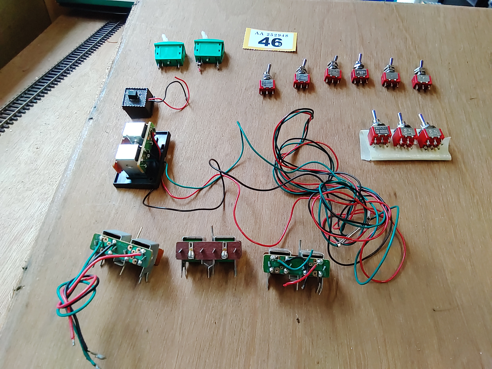
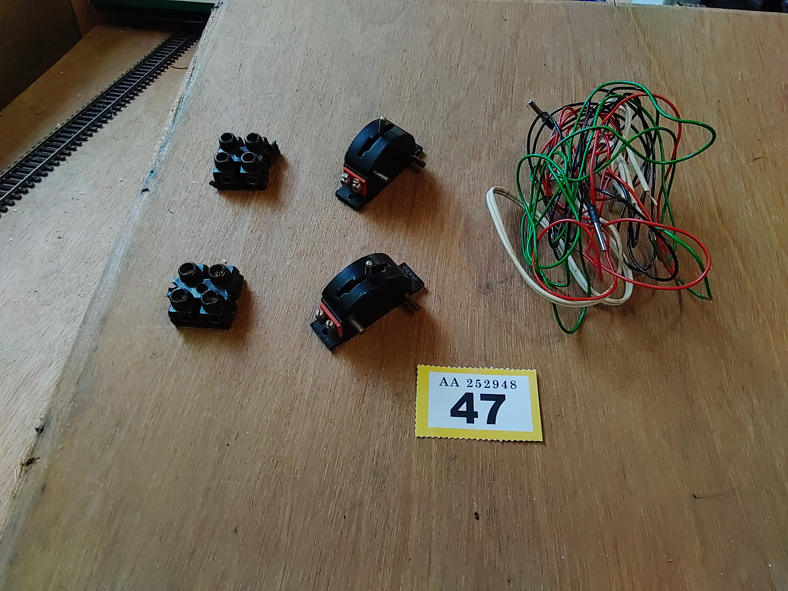
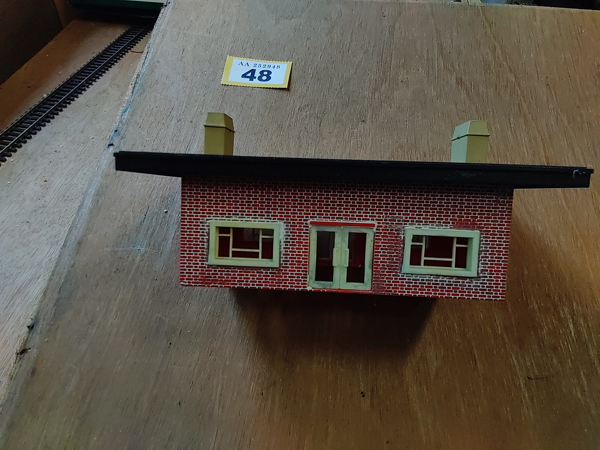
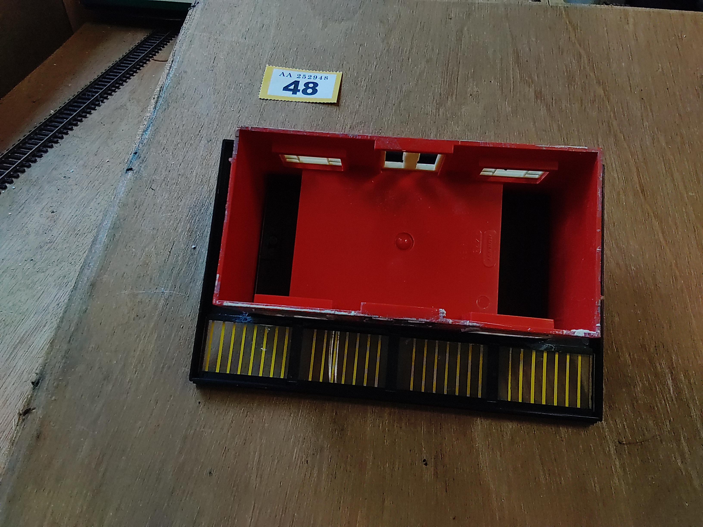
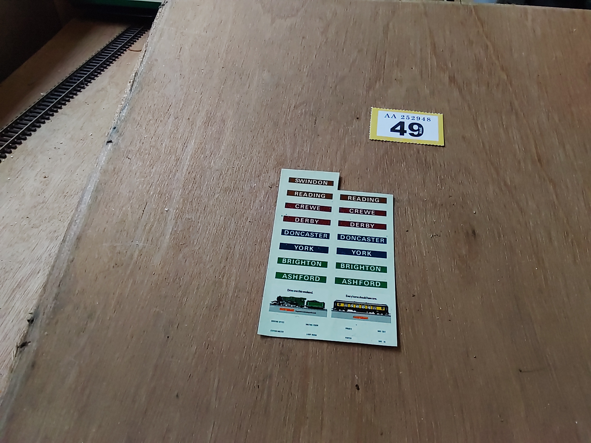
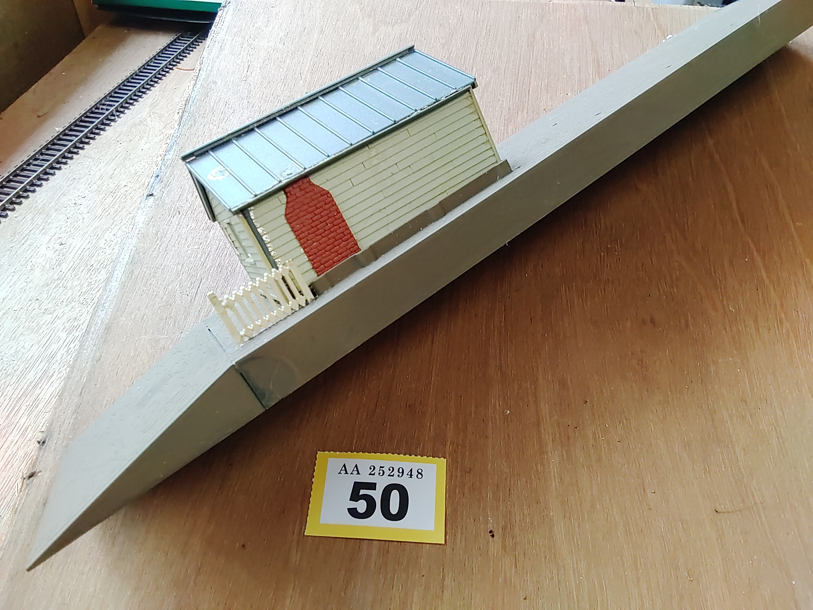
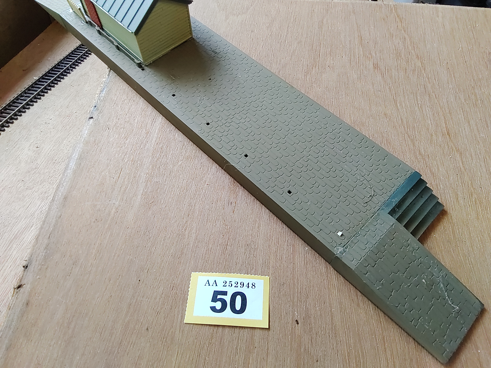
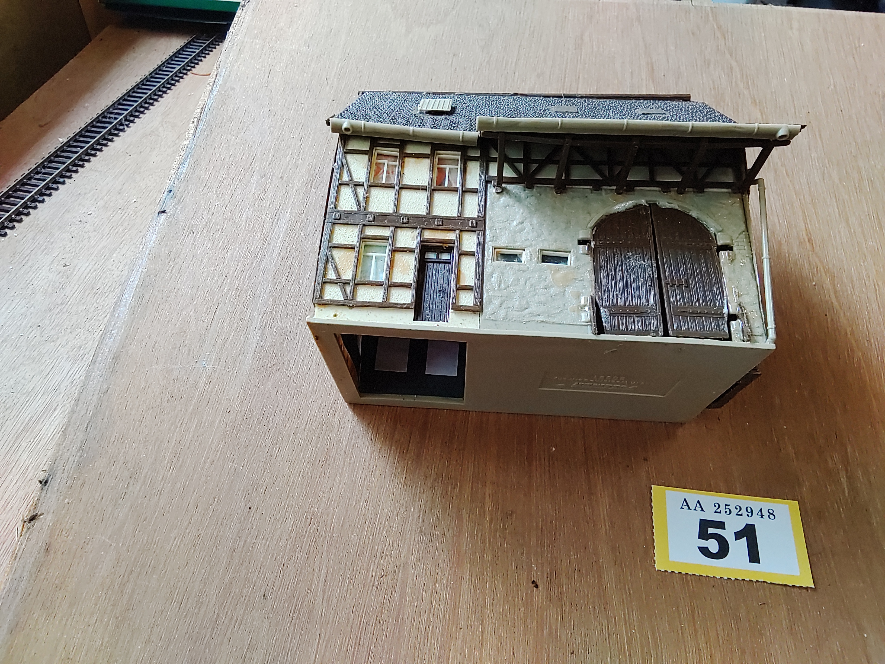
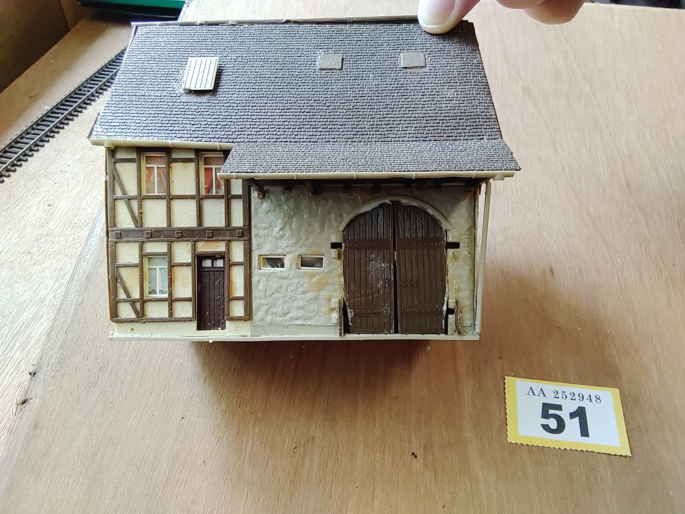

[**Back to front page**](/README.md)
1.  [**Lots 001&ndash;015**](/Batch-01.md)
2.  [**Lots 016&ndash;030**](/Batch-02.md)
3.  [**Lots 031&ndash;045**](/Batch-03.md)
4.  This is Batch 4
5.  [**Lots 053&ndash;058**](/Batch-05.md)
6.  [**Lots 059&ndash;063**](/Batch-06.md)
7.  [**Lots 064&ndash;067**](/Batch-07.md)
8.  [**Lots 068&ndash;100**](/Batch-08.md)
9.  [**Lots 101&ndash;126**](/Batch-09.md)
10. [**Lots 127&ndash;130**](/Batch-10.md)
11. [**Lots 131&ndash;139**](/Batch-11.md)
12. [**Lots 140&ndash;144**](/Batch-12.md)
13. [**Lots 145&ndash;149**](/Batch-13.md)
14. [**Lots 150&ndash;153**](/Batch-14.md)
15. [**Lots 154&ndash;165**](/Batch-15.md)

# Batch 4
<section>
    <h2>Lot 046</h2>
    
</section>
<section>
    <h2>Lot 047</h2>
    
</section>
<section>
    <h2>Lot 048</h2>
    
    
    
    
</section>
<section>
    <h2>Lot 049</h2>
    
</section>
<section>
    <h2>Lot 050</h2>
    
    
    
</section>
<section>
    <h2>Lot 051</h2>
    
    
    
</section>
<section>
    <h2>Lot 052</h2>
    
    
    
</section>