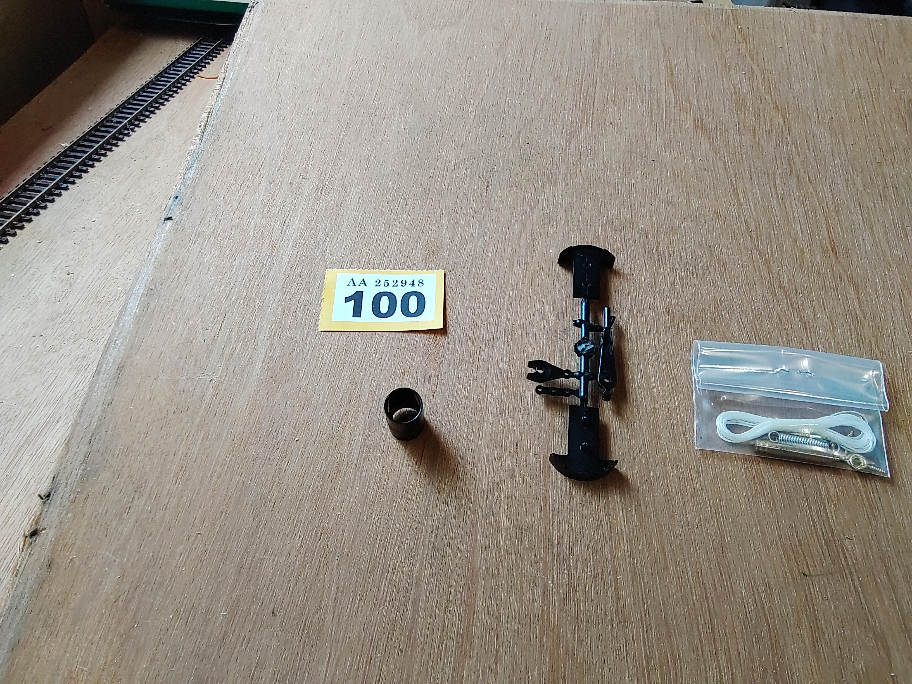

[**Back to front page**](/README.md)
1.  [**Lots 001&ndash;015**](./Batch-01.md)
2.  [**Lots 016&ndash;030**](./Batch-02.md)
3.  [**Lots 031&ndash;045**](./Batch-03.md)
4.  [**Lots 046&ndash;052**](./Batch-04.md)
5.  [**Lots 053&ndash;058**](./Batch-05.md)
6.  [**Lots 059&ndash;063**](./Batch-06.md)
7.  [**Lots 064&ndash;067**](./Batch-07.md)
8.  This is Batch 8
9.  [**Lots 101&ndash;126**](./Batch-09.md)
10. [**Lots 127&ndash;130**](./Batch-10.md)
11. [**Lots 131&ndash;139**](./Batch-11.md)
12. [**Lots 140&ndash;144**](./Batch-12.md)
13. [**Lots 145&ndash;149**](./Batch-13.md)
14. [**Lots 150&ndash;153**](./Batch-14.md)
15. [**Lots 154&ndash;165**](./Batch-15.md)

# Batch 8
<section>
    <h2>Lot 068</h2>
    
    
    
</section>
<section>
    <h2>Lot 069</h2>
    
    
    
</section>
<section>
    <h2>Lots 070, 071, 072, 073</h2>
    
</section>
<section>
    <h2>Lots 074, 075, 076, 077, 078</h2>
    
</section>
<section>
    <h2>Lots 079, 080, 081, 082, 083, 084</h2>
    
</section>
<section>
    <h2>Lots 085, 086, 087, 088, 089, 090, 091</h2>
    
</section>
<section>
    <h2>Lots 092, 093, 094, 095</h2>
    
</section>
<section>
    <h2>Lot 096</h2>
    
</section>
<section>
    <h2>Lot 097</h2>
    
</section>
<section>
    <h2>Lots 098, 099</h2>
    
</section>
<section>
    <h2>Lot 100</h2>
    
</section>