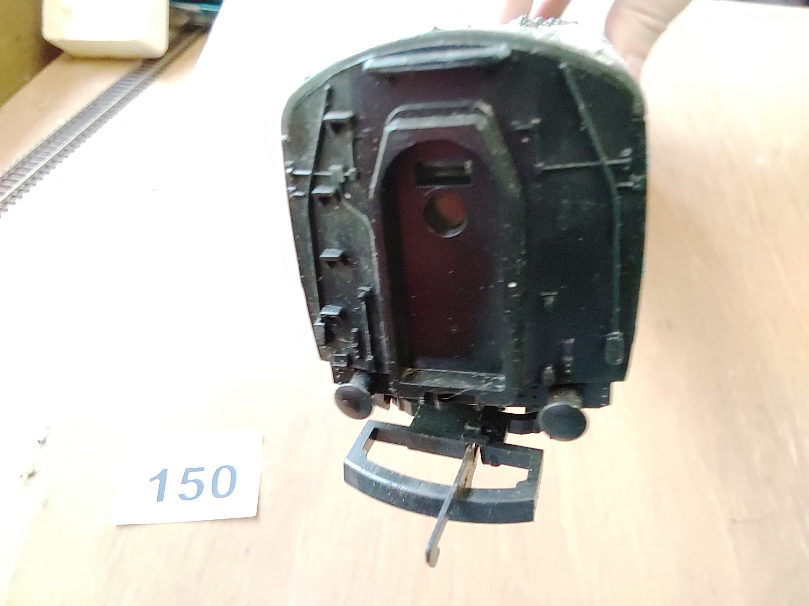
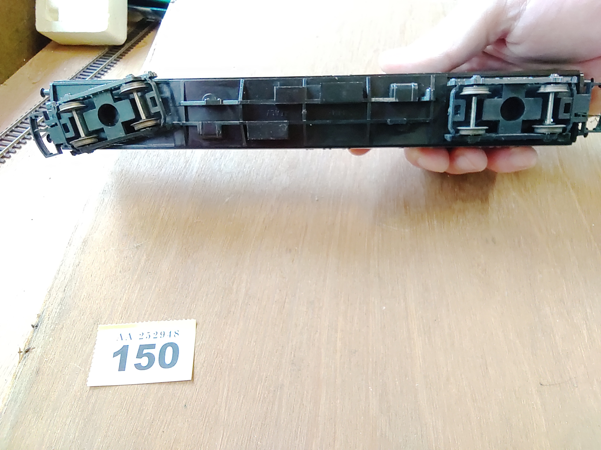
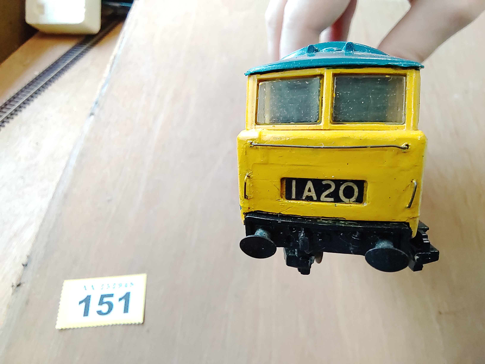
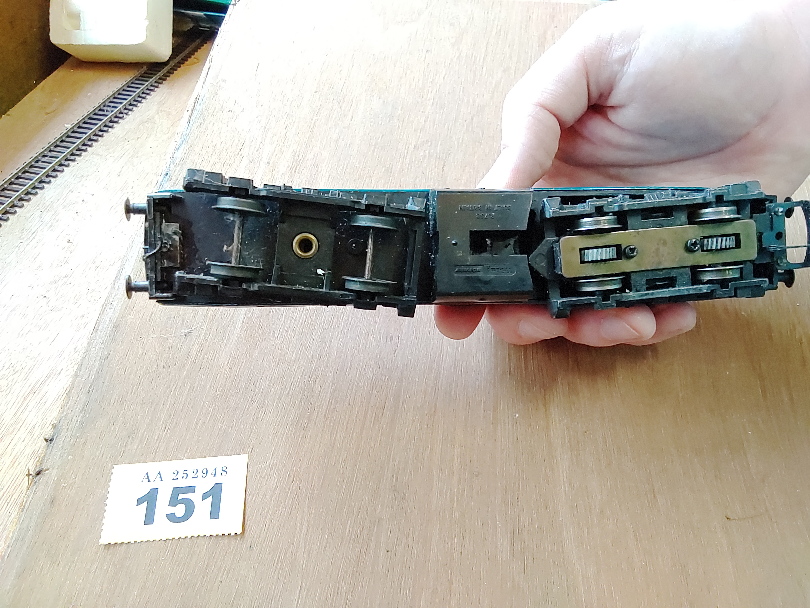
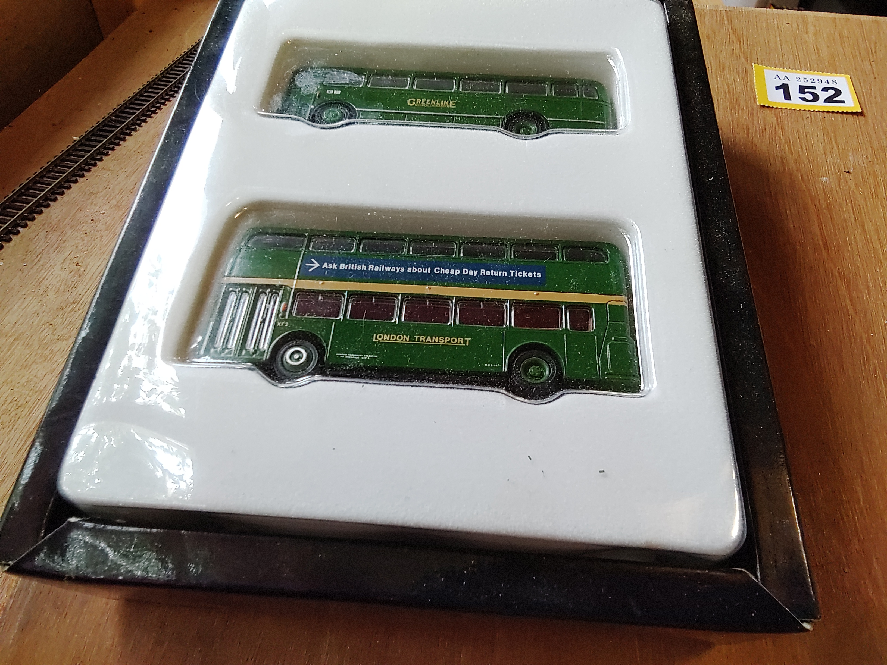
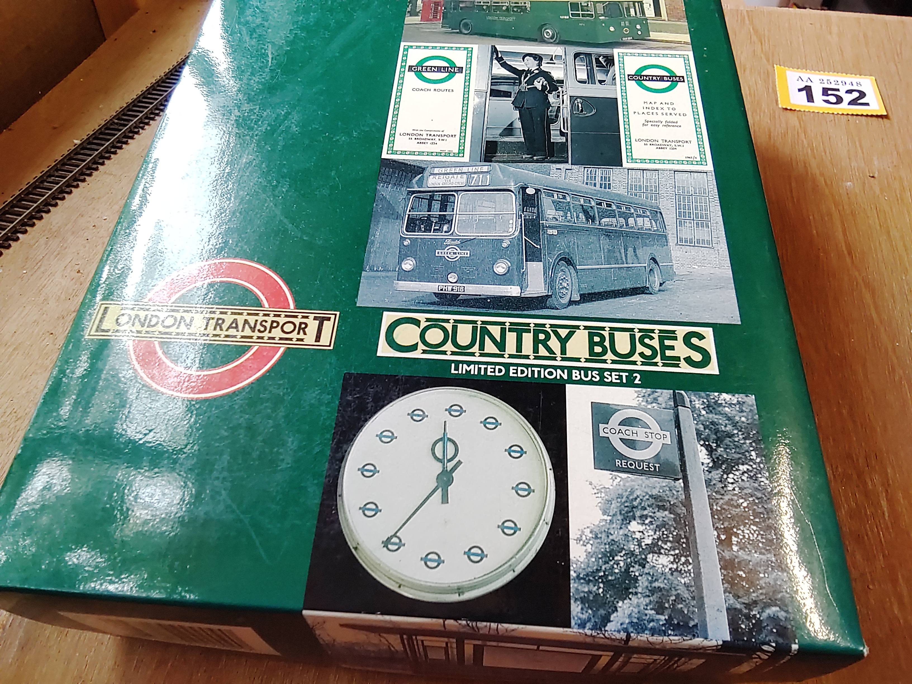
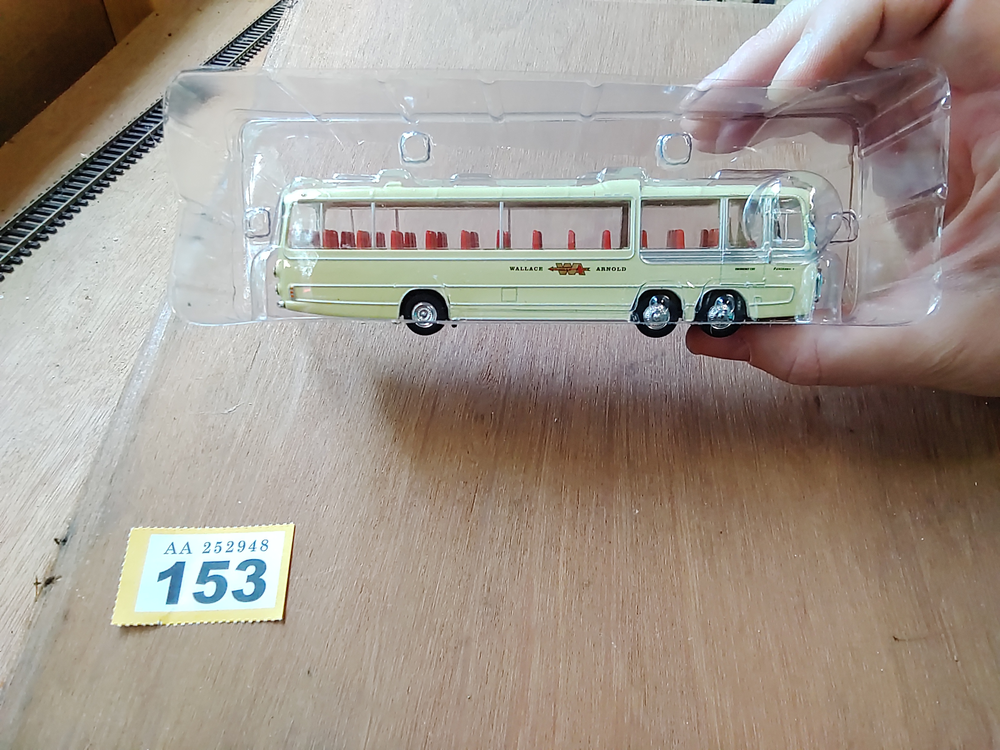
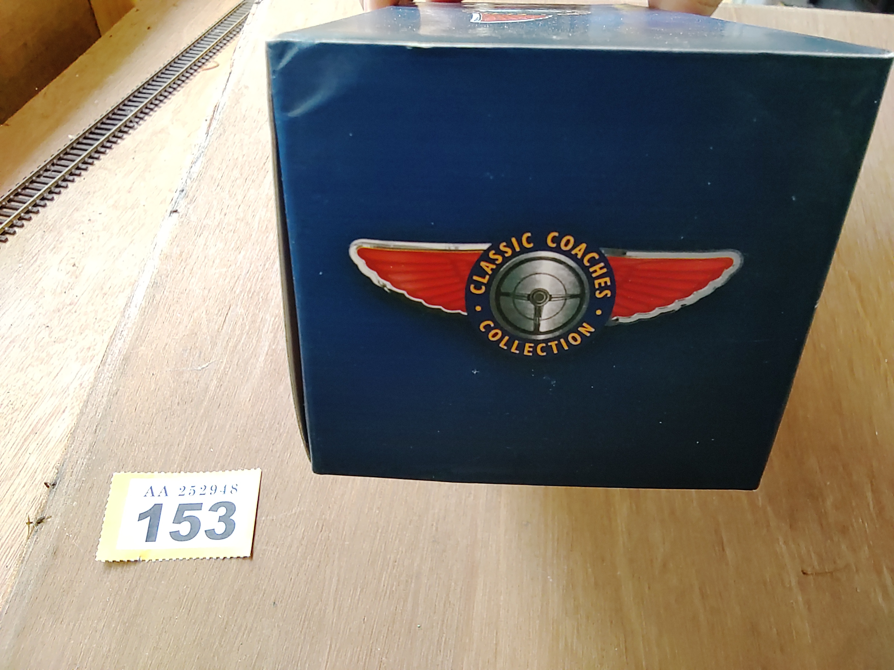
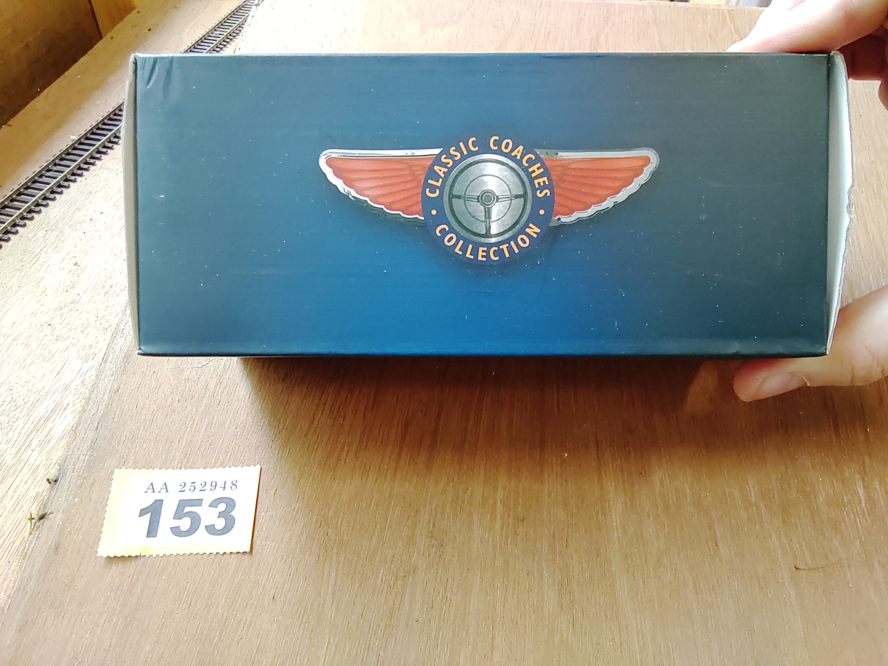

[**Back to front page**](/README.md)
1.  [**Lots 001&ndash;015**](./Batch-01.md)
2.  [**Lots 016&ndash;030**](./Batch-02.md)
3.  [**Lots 031&ndash;045**](./Batch-03.md)
4.  [**Lots 046&ndash;052**](./Batch-04.md)
5.  [**Lots 053&ndash;058**](./Batch-05.md)
6.  [**Lots 059&ndash;063**](./Batch-06.md)
7.  [**Lots 064&ndash;067**](./Batch-07.md)
8.  [**Lots 068&ndash;100**](./Batch-08.md)
9.  [**Lots 101&ndash;126**](./Batch-09.md)
10. [**Lots 127&ndash;130**](./Batch-10.md)
11. [**Lots 131&ndash;139**](./Batch-11.md)
12. [**Lots 140&ndash;144**](./Batch-12.md)
13. [**Lots 145&ndash;149**](./Batch-13.md)
14. This is Batch 14
15. [**Lots 154&ndash;165**](./Batch-15.md)

# Batch 14
<section>
    <h2>Lot 150</h2>
    
    
    
</section>
<section>
    <h2>Lot 151</h2>
    
    
    
</section>
<section>
    <h2>Lot 152</h2>
    
    
    
</section>
<section>
    <h2>Lot 153</h2>
    
    
    
    
    
    
    
    
</section>